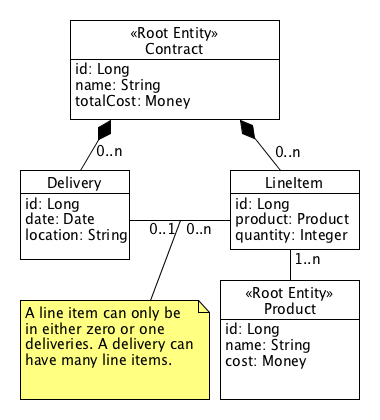
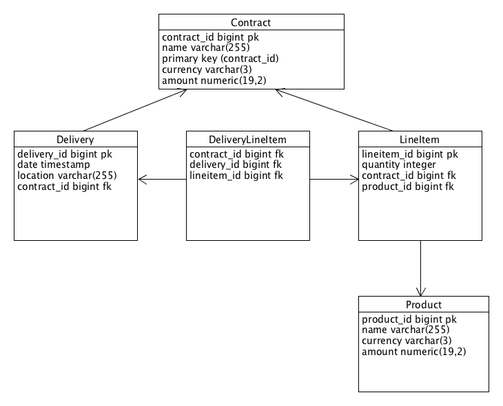

# Entities, Value Objects, Aggregates and Roots with JPA

A friend with a relational database background was working on an OO 
domain modelling problem. I started talking about "aggregates" and "roots" 
and to saying things like "make the contract entity an aggregate 
controlling the other entities" and that "external logic 
should speak to the object model via a few root entities". This demo 
project is some Java code to demonstrate those concepts. 

A quick introduction to the entities, aggregates, value objects and roots 
with a links into the seminal textbook Domain Driven Design by 
Eric Evans is [here](https://lostechies.com/jimmybogard/2008/05/21/entities-value-objects-aggregates-and-roots/). 

### Running The Code

The code is written using IntelliJ communit edition. Create a new project from source selecting "maven" as the type. You can then run the test class which roundtrips all the objects to a database. 

You can build the code with commandline maven but for some reason the unit test isn't being run automatically. 

### The Problem Space

The following image shows the toy modelling problem: 

 1. A `contract` has many `lineitems` 
 1. A `contract` has many `deliveries` 
 1. A `delivery` to a location has a number of `lineitems`
 1. A `lineitem` names a quantity of a given `product` within a `contract`
 1. A `lineitem` can only be in zero or one `deliveries`
 1. Altering the `lineitems` within a `contract`updates the total cost of a contract

A `lineitem` can be in zero `deliveries` is so that a customer 
can decide upon the products and even pay for a contract independently of 
arranging for one or more `deliveries`. 

Note that `Money` is a value object type. It has no identity so its not 
an entity.  

Note that in the diagram the lines with the black diamonds on the end denote 
UML "composition". To quote wikipedia: 

> Composition is a kind of association where the composite object has 
> sole responsibility for the disposition of the component parts. 
> The relationship between the composite and the component is a strong 
> “has a” relationship, as the composite object takes ownership of the 
> component. This means the composite is responsible for the creation and 
> destruction of the component parts. An object may only be part of one 
> composite. If the composite object is destroyed, all the component parts 
> must be destroyed. 

Simply put we are saying that the `contract` owns and controls both the `deliveries` and 
`lineitems` that it contains. If the `contract` gets cancelled or deleted then 
all the `lineitems` are cancelled and deleted. Also in this eample updating 
the quantity of a `product` in the `contract` or adding and removing `deliveries` 
to the `contract` implies we are updating the `contract`. (In the real world we 
would add a status field to `contract` such as "draft"/"signed" and perhaps 
add a version number field if we are allowed to amend a signed contract). 

The `product` and `contract` classes are labelled as root entities. To 
quote the blog page at the link above 

> Aggregates draw a boundary around one or more Entities.  
> An Aggregate enforces invariants for all its Entities 
> for any operation it supports.  Each Aggregate has a Root 
> Entity, which is the only member of the Aggregate that any 
> object outside the Aggregate is allowed to hold a reference to. 

This says that to get at the quantity of a `product` in a `contract` or the 
`deliveries` in a `contract` (or whatever) in the object world we load the 
contract and go via it. This implies that to load things from a database 
into memory we will query and load one or more `contracts` to work with rather than 
query and load `deliveries` or `line items` directly. Is that the 
right things to do? Test it out with your users if they are always talking about working 
with a contract to manage its line items and deliveries then yes. If they 
are asking you to build screens that work primarily with deliveries and 
you discover that you can move a delivery between contracts then you 
may need to make `delivery` a root entity. 

Consider the business rule that altering the `lineitems` with a `contract`
updates the total cost of a contract. Expressed another way it says that 
it is a rule (aka an invariant) that the total cost field of the contract 
is sum of the cost of the individual line items within the contract. Which 
class should take care of that? The `contract`. Why? Objects should 
encapsulate state and related behaviour. Implication? You ask the `contract` 
to alter the quantity of a line item, else add or remove a line item. It 
can then ensure that the `totalCost` is updated. 

Consider the business rule that a `lineitem` can only be within one 
`delivery`. Which class should take care of that? The `contract`. Why? 
If we don't it is a corruption of the state of a `contract`. So we should 
keep the logic that stops it from getting corrupted within it. That logic will 
be tested when we test that class and will be easier to keep working 
as we evolve the logic of that class. 

The book [Domain Driven Design by Eric Evans](http://domainlanguage.com/ddd/) has the theory of how to do design 
this way and the book [Pojos In Action by Chris Richardson](https://www.manning.com/books/pojos-in-action) is an 
old but excellent book on how to do DDD in Java with Spring. 

### Detour: JPA? 

For the purposes of this demo JPA is an officially supported part of the 
Java ecosystem and is a mature and well documented Java-to-relational 
mapping tool. Yes it has a number of quirks. If you fight 
it your probably going to loose (your mind). If you learn how to do the 
basics and don't deviate from that it can be a used as a rapid application 
tool to support an agile TDD build on Java against a relational datbase. 

Why is JPA not universally loved? I would say that it is not because JPA 
isn't a serious bit of technology that has had a huge amount of investment 
in it. It is because of the famous [object to relational impedance mis-match](https://en.wikipedia.org/wiki/Object-relational_impedance_mismatch). 
Functional programmers will say that the problem is actually that OO is 
a concept with many traps and limited utility but that is an entirely 
different topic. A lot of developers think that working with an RDBM isn't 
at all agile. If you let JPA create tables into an in-memory java database 
then it can be very agile and only a matter of changing the configuration 
to switch betwen unit tests running against an in-memory Java database  
and a beefy database server. 

Also if there is any ugliness due to our use of JPA then we can use that to 
illustrate a point in this demo: that the database and its mapping is an 
implementation detail that should be hidden from code that uses our object model. 

### The Implementation

Lets have a look at the relational table model that goes the UML model above: 

The major difference is that we have one more database table than we 
have UML entities. The alien in the room is `delivery_lineitem` which is a 
join table between `delivery` and `lineitem` which records that a line 
item has been put into a delivery. Note that in the relational world we 
don't really need `contract_id` on the join table; it needs only two 
column which would have been the primary key. The reason that the table 
has the `contract_id` is so that JPA can "see" the join entities as part 
of the `contract` root object to load them when ever we load the `contract`. 
Another compromise is that if you run the code it creates the join table with 
a seperate primary key column. Why? Because JPA put put a fight when I tried 
to create any type of compound primary key out of existing fields and if 
fight JPA you loose (your mind). 

Why is the join entity an alien? Because in our example it wasn't in the UML 
model as wasn't discovered in the elaboration of the domain model with the 
users. If it was a "real thing" the users would have given it a name and talked 
about it having tangible attributes such that it would be in the UML model. So 
it's only an technical artifact of the relational model.

How do we handle this? We make the `contract` the responsible class and 
put both the business logic, and the logic to keep the object and relational 
book work in sync, into this "all things contract related class": 

 1. We add a Java class entity for the join table but don't make it a public class. 
 2. We don't let code directly manipulate the list of lineitems within a delivery. 
  We ask the contract to do the work. The contract can create or remove a 
   join entity and also update the list of lineitems withing the delivery.
 3. We add a `@PostLoad` to the contract that is run immediately after JPA has 
 loaded a contract, its deliveries, its lineitems, and its join table entities 
 from the db. In that method we can scan the list of join table entities 
 to know now to recover the state of the list of lineitems in each delivery.
   
All of the above nicely illustates the power of the aggregate and root entity 
concepts. We can create a java package per root entity, with a service or 
system class that lets you load the root object only, force code outside 
of the package to use methods on the root object, and the root object can 
enforce that everything is maintained in a proper state and that we don't 
get corruptions of the state of the aggregate set of objects that the root 
entity controls. 
 
How do we stop code outside of the `contract` package from corrupting 
the relationships by adding or removing lineitems from deliveries without 
going the methods on contract which ensure the join table is kept in sync? 
The following code show how the list of lineitems in a delivery is declared: 
    
    @Transient
    List<LineItem> lineItems = new ArrayList<>();
    
    public List<LineItem> getLineItems() {
        return Collections.unmodifiableList(lineItems);
    }

That syntax says we have a non-public list (invisible outside of the 
Java package) that is transient (JPA wont try to save it that list into 
the datbase its a list maintained by Java logic only). The getter that 
returns the list wraps it in an unmodifiable list. Thats a proxy object 
that lets you get at items in the list but throws an exception if you try 
to modify the list. Ninja. The net result is that you can "see" both 
`contract`, `lineitem` and `delivery` objects outside of the package that 
they are defined in, but you have to call methods on the `contract` objects 
to modify anything. To load and save contract objects you use a `ContractServce` 
system class that has methods to query the database to load contracts. 

### See Also

See also the discussion on the ["exposed domain model pattern"](http://codereview.stackexchange.com/questions/93511/data-transfer-objects-vs-entities-in-java-rest-server-application/93533#93533)
